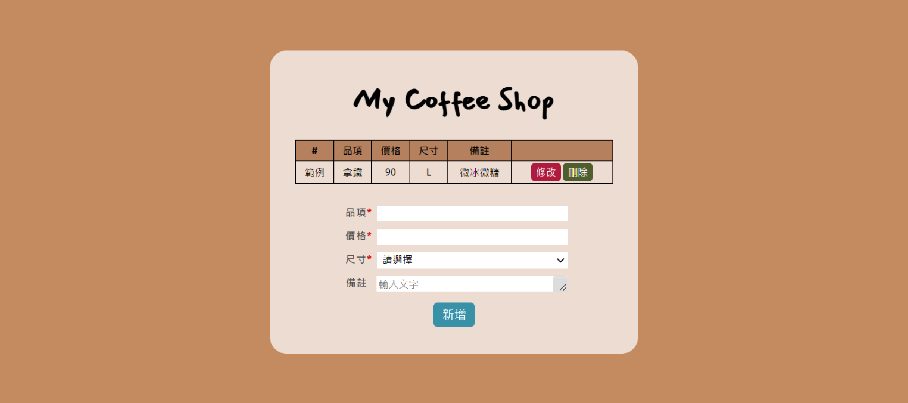

# coffeeshop 專案 with Vue.js



## Demo
https://yishanstephyhung.github.io/coffeeshop-webapp/

## Intro
這是一個使用 vue cli 及 vue router 製作的咖啡訂單系統。

> #### 安裝
```
npm install -g @vue/cli
```

> #### 功能需求
+ 主頁面的訂單列表呈現
+ 訂單欄位:
    1. `name` : 品項名稱
    2. `price` : 價格
    3. `size` : L/M/S
    4. `notes` : 非必填多行文字內容
+ 新增訂單
+ 刪除單筆訂單
+ 編輯單筆訂單

> #### 流程
+ 新增訂單
    1. 確認必填輸入框是否填寫，若沒有則出現Error提示文字。
    2. 價格在新增時只能填入正整數。
    2. 判斷若無Error則push到訂單Array裡。
    3. 清空輸入欄。
+ 刪除單筆訂單
    1. 根據每行id，使用splice刪除。
+ 編輯單筆訂單
    1. 點擊「修改」按鈕，按鈕轉變為「儲存」按鈕，同時該行資料以contenteditable = true變成可修改狀態。
    2. 修改完畢後，按下「儲存」按鈕即轉換為不可修改狀態。
    3. 一次只能修改一筆訂單。
